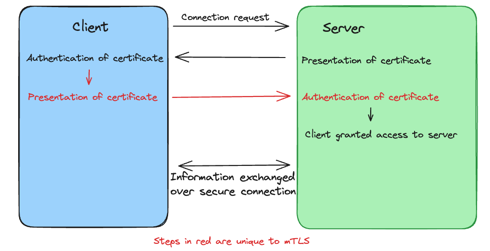

# mTLS

## Overview
mTLS is a method of authentication in which both the sender and receiver (client and server) must verify their identity before a connection is allowed to be established. 

## Difference to TLS
In a standard TLS protocol, upon request by a client, the server presents its certificate which authenticates that it has the expected private key. The connection is then established and the client commences delivery of data to the authenticated server. 

In mTLS, by contrast, following the steps outlined above, the client must then present *its* certificate for authentication by the server. If the client is unable to verify itself, connection to the server is denied. 

As the organisation operating the server is the sole authority on which clients are allowed to connect to its servers, that organisation can act as its own certificate authority, rather than requiring a certificate provided by an external authority, as is the case with the certificate that the server provides to the client. 

# Use cases
mTLS is frequently used in situations where the client may not have a login interface, such as Internet of Things devices. 

It is also used within organisations which operate ZeroTrust frameworks, in which no user, client or machine is trusted by default and all connections must prove their authenticity before being allowed to access a network. 

One example of an application which uses mTLS is the Mastercard API. 

